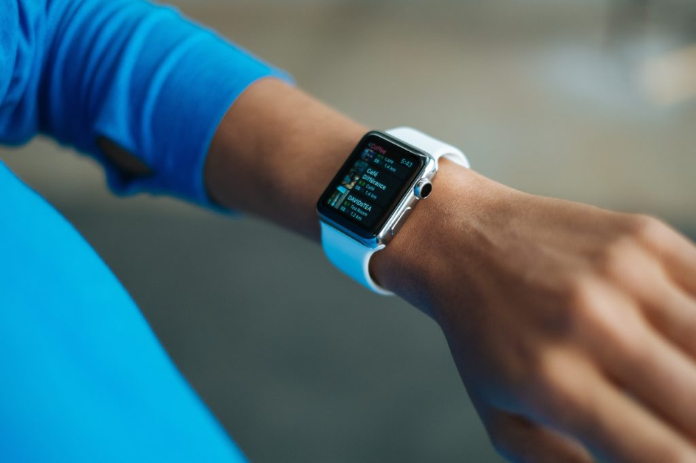
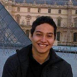

Rigi Research       

   

We do research in CPSnbfgfggfg:
==================

Self-Adaptive Systems, Cyber-Physical Systems, DevOps, Cognitive Computing

*   [Meet the team](#team)
*   [Our Research](#research)

Our Research
------------

### Smart Cyber-Physical-Human Systems

Users have shown to be active elements with their daily applications, the boundaries that separate users with their devices are rapidly fading as the components become smarter and more knowledgeable about the users. It is pertinent that software engineers look at the role of users as first class elements on the systems that are being designed, going further when it comes to personalization, tailoring applications to fit users' dynamic lives. We envision that users will be sharing their technological presence through virtual personalities, and situations will be the ones to determine the boundaries of the context of each of them. We envision, CPS to be improved with situation-aware self-adaptive applications to provide users truly personalised functionalities and features.

*   [More](#)

### CAVA: Context-aware Real-time Video Analytics

Cameras are found everywhere in the Internet of Things (IoT). We propose a scalable platform using SAVI for the continuous collection of context-aware processed video from mobile devices. Users can perform efficient context-based searches on the total collection of labeled videos. In this project we discuss the challenges and benefit.s for video upload, video labeling and context-based search on the SAVI network

*   [More](#)

### Smart Autoflight Control System

The visioned concept particularly aims at integrating Air Traffic Control (ATC) and the operational environment into the automatic decision making process. Suitable Artificial Intelligence (AI) methods and algorithms shall be studied and evaluated on a small commercially available Unmanned Air Vehicle (UAV). The Unmanned Aircraft System (UAS) will be extended to support simulated interactions with ATC and mission control. The resulting system shall be able to perform missions on the basis of abstract goal descriptions that may change during the flight and require revised online flight planning and an adapted aircraft systems configuration in a hard real-time environment constrained by bounded rationality and bounded reactivity.

*   [More](#)

### CAPRecipes: Context-Aware Personalized Recipe Recommender

CAPRecipes is our context-aware recommender system, which provides personalized meal recipes to users by leveraging their personal context (i.e., preferences, and health goals) and the information in their instrumented refrigerator and pantry (i.e., available food in the users’ home). CAPRecipes operates around the following three concerns of users: (1) preparing a tasty and healthy meal; (2) minimizing food wastage at home; and (3) consideration of their taste preferences, allergies, and other restrictions when selecting a proper recipe. CAPRecipes automatically searches personal recipes while adapting to dynamic changes in their context.

*   [More](#)

### Foodie Cognitive Bot

Foodie is a smart conversational agent that helps users in the kitchen by interacting with them about their dietary preferences, needs, constraints and goals. Foodie accomplishes this by making use of IBM Watson’s Conversation Platform API10 to recognise users’ intent, and understand events related to the users and their context. To support the knowledge base for conversations, Foodie uses various services including Spoonacular, FoodEssentials, and Watson services through their REST APIs. Users ideally interact with Foodie via a hybrid interface (i.e., voice and text) and can be integrated with services, such as Slack, Facebook Messenger, Google Assistant or Siri.

*   [More](#)

### DevOps

*   [More](#)

Meet the Rigi Team
------------------

### Hausi A. Müller

Professor, Associate Dean Research PhD PEng FCAE  
Faculty of Engineering  
Department of Computer Science  
University of Victoria

### Lorena Castañeda PhD

**Postdoctoral Fellow**

*   Cyber-Physical-Human Systems
*   Models at Runtime
*   Self-Adaptive Systems

### Miguel Jimenez

**PhD Student**

*   DevOps
*   Models at Runtime

### Nina Taherimakhsousi

**PhD Candidate**

*   Context-Based Face Recognition
*   Self-Adaptive Systems

### Stephan Heinemann

**PhD Candidate**

*   Self-Adaptive Systems

### Prashanti Priya Angara

**MSc Student**

*   Cognitive Computing
*   Cyber-Physical Systems

### Harshit Jain

**MSc Student**

*   Smart Health Maven

### Roshni Jain

**MSc Student**

*   Smart Health Maven

© Untitled. All rights reserved. Demo Images: [Unsplash](https://unsplash.com). Design: [HTML5 UP](https://html5up.net).
